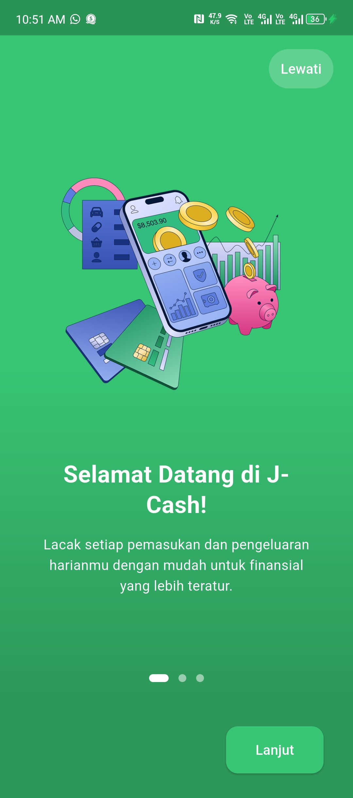
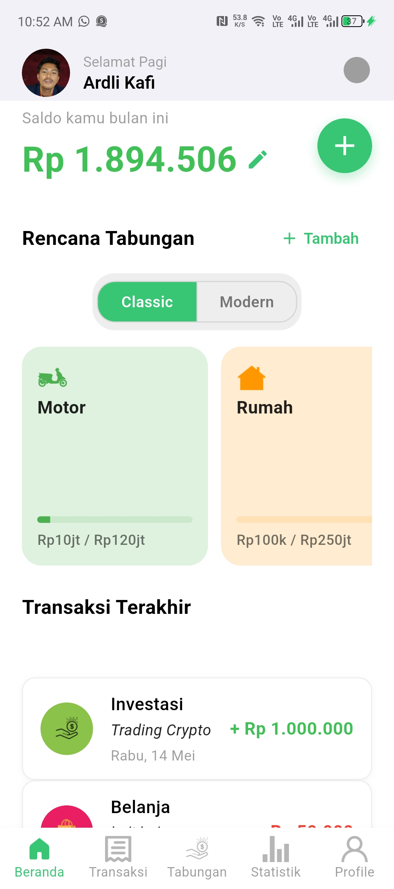

<p align="center">
  
</p>

<h1 align="center">💸 J-Cash</h1>
<p align="center">
  <b>Aplikasi Keuangan Pribadi Flutter dengan Firestore Real-time</b><br>
  
  
  
</p>

---

## ✨ Fitur Utama

- 🔥 **Integrasi Firestore Real-time**: Semua data transaksi, kategori, tabungan, dan statistik langsung tersimpan & update di Firestore.
- 📊 **Statistik Lengkap**: Ringkasan, grafik tren, pie chart, filter custom, dan statistik keseluruhan.
- 💰 **Manajemen Saldo Otomatis**: Saldo otomatis update sesuai transaksi, bisa edit manual.
- 🏷️ **Kategori Dinamis**: Kategori transaksi per user, migrasi otomatis dari default.
- 📝 **Catatan & Detail Transaksi**: Simpan dan tampilkan catatan pada setiap transaksi.
- 🔔 **Notifikasi**: Mendukung notifikasi keuangan.
- 🔄 **Pull-to-Refresh**: Tarik layar untuk refresh data di riwayat & beranda.
- 🎨 **UI Modern & User-friendly**: Tampilan rapi, responsif, dan mudah digunakan.

---

## 📱 Screenshot

<p align="center">
  
  
  
</p>

---

## 🚀 Cara Build & Jalankan

1. **Clone repo ini:**
   ```bash
   git clone https://github.com/ardlikafi/J-cash.git
   cd J-cash
   ```

2. **Install dependencies:**
   ```bash
   flutter pub get
   ```

3. **Setup Firebase:**
   - Download `google-services.json` dari Firebase Console.
   - Letakkan di folder `android/app/`.

4. **Generate icon aplikasi:**
   ```bash
   flutter pub run flutter_launcher_icons:main
   ```

5. **Build APK:**
   ```bash
   flutter build apk --release
   ```

6. **Jalankan di emulator/device:**
   ```bash
   flutter run
   ```

---

## 🛠️ Stack & Teknologi

- [Flutter](https://flutter.dev/) 3.x
- [Firebase Firestore](https://firebase.google.com/docs/firestore)
- [Provider](https://pub.dev/packages/provider)
- [fl_chart](https://pub.dev/packages/fl_chart)
- [intl](https://pub.dev/packages/intl)
- [flutter_launcher_icons](https://pub.dev/packages/flutter_launcher_icons)
- [date_picker_timeline](https://pub.dev/packages/date_picker_timeline)
- [firebase_auth](https://pub.dev/packages/firebase_auth)
- [google_sign_in](https://pub.dev/packages/google_sign_in)

---

## 🙌 Kontribusi

Pull request, issue, dan saran sangat diterima!  
Jangan lupa ⭐️ repo ini jika bermanfaat.

---

## 📄 Lisensi

MIT License © 2025 [ardlikafi](https://github.com/ardlikafi)
